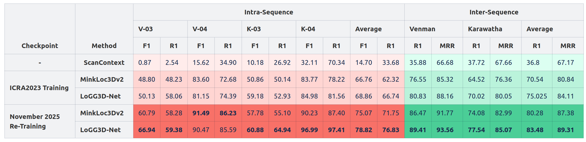

# Wild-Places: A Large-Scale Dataset for Lidar Place Recognition in Unstructured Natural Environments
<!-- ## [Website](https://csiro-robotics.github.io/Wild-Places/) | [Paper](https://arxiv.org/abs/2211.12732) | [Data Download Portal](https://data.csiro.au/collection/csiro:56372?q=wild-places&_st=keyword&_str=1&_si=1) -->

<div align="center">
<a href="https://arxiv.org/abs/2211.12732"></a>
<a href='https://csiro-robotics.github.io/Wild-Places/'></a>
<a href='https://huggingface.co/CSIRORobotics/Wild-Places'></a>
<a href='https://data.csiro.au/collection/csiro:56372?q=wild-places&_st=keyword&_str=1&_si=1'></a>
</div>


This repository contains the code implementation used in the paper *Wild-Places: A Large-Scale Dataset for Lidar Place Recognition in Unstructured Natural Environments*, which has been published at ICRA2023.  

If you find this dataset helpful for your research, please cite our paper using the following reference:
```
@inproceedings{2023wildplaces,
  title={Wild-places: A large-scale dataset for lidar place recognition in unstructured natural environments},
  author={Knights, Joshua and Vidanapathirana, Kavisha and Ramezani, Milad and Sridharan, Sridha and Fookes, Clinton and Moghadam, Peyman},
  booktitle={2023 IEEE international conference on robotics and automation (ICRA)},
  pages={11322--11328},
  year={2023},
  organization={IEEE}
}
```

## Contents
1. [Updates](#updates)
2. [Download Instructions](#download-instructions)
3. [Benchmarking](#benchmarking)
    * [Checkpoints](#checkpoints)
    * [Performance](#performance)
4. [Scripts](#scripts)
    * [Loading Point Clouds](#loading-point-clouds)
    * [Training](#training)
    * [Evaluation](#evaluation)
4. [Thanks](#thanks)

## Updates 
- **Oct 2022** Wild-Places v1.0 Uploaded
- **Jan 2023** Wild-Places is accepted to ICRA2023!
- **Jan 2023** Wild-Places v2.0 Uploaded.  This update to the dataset integrates GPS into the SLAM solution to alleviate vertical drift in the larger loops of the traversal in both environments. NOTE: Sequence K-04 is currently unavailable for v2.0 due to a failed loop closure in the ground truth.  We are currently working on remedying this, and will release the sequence as soon this issue is rectified.
- **Feb 2025** Fix the broken timestamps in the poses files. 
- **Nov 2025** Wild-Places v3.0 Uploaded.  This update to the dataset includes:
    - Updated point clouds / trajectories using the latest version of WildCat to bring the dataset in line with the pointclouds available in the WildScenes and WildCross datasets
    - Updated benchmarking results and instructions for training on LoGG3D-Net and MinkLoc3Dv2 
    - Updated dataset and repository file structure


## Download Instructions

Our dataset can be downloaded through [The CSIRO Data Access Portal](https://data.csiro.au/collection/csiro:56372?q=wild-places&_st=keyword&_str=1&_si=1). Detailed instructions for downloading the dataset can be found in the README file provided on the data access portal page. 


## Benchmarking
Here we provided pre-trained checkpoints and results for benchmarking several state-of-the-art LPR methods on the Wild-Places dataset.

**Update Nov. 2025**:  With the release of Wild-Places v3.0, we have also re-run training for two state-of-the-art methods (LoGG3D-Net, MinkLoc3Dv2) on the Wild-Places dataset using expanded batch sizes to provide new training checkpoints which better reflect the capabilities of recent state-of-the-art GPUs.  We provide checkpoints and benchmarked results for both the recently trained models and the checkpoints released with the ICRA2023 paper.

### Checkpoints
|Release| Model      | Checkpoint |
|------------|------------|------------|
|ICRA2023| TransLoc3D | [Link](https://huggingface.co/CSIRORobotics/Wild-Places/resolve/main/ICRA_2023_checkpoints/TransLoc3D.pth)       |
|ICRA2023| MinkLoc3DV2  | [Link](https://huggingface.co/CSIRORobotics/Wild-Places/resolve/main/ICRA_2023_checkpoints/MinkLoc3Dv2.pth)       |
|ICRA2023| LoGG3D-Net | [Link](https://huggingface.co/CSIRORobotics/Wild-Places/resolve/main/ICRA_2023_checkpoints/LoGG3D-Net.pth)       |
|2025 Re-Training| MinkLoc3DV2  | [Link](https://huggingface.co/CSIRORobotics/Wild-Places/resolve/main/2025_updated_checkpoints/MinkLoc3Dv2.pth)       |
|2025 Re-Training| LoGG3D-Net  | [Link](https://huggingface.co/CSIRORobotics/Wild-Places/resolve/main/2025_updated_checkpoints/LoGG3D-Net.pth)       |


### Performance


## Scripts
### Loading Point Clouds
A code snippet to load a pointcloud file from our dataset can be found in `eval/load_pointcloud.py`
### Training
We provide instructions for how to add Wild-Places as a training dataset for two state-of-the-art LPR methods: [LoGG3D-Net](https://github.com/csiro-robotics/LoGG3D-Net) and [MinkLoc3Dv2](https://github.com/jac99/MinkLoc3Dv2).  For more detailed instructions, please consult the `README.md` files in `training/LoGG3D-Net` and `training/MinkLoc3Dv2`.
### Evaluation
We provide generic evaluation code for evaluating performance on the Wild-Places dataset for both the inter and intra-sequence testing scenarios, as well as an implementation of ScanContext.  For more details, please see the `README.md` file in the `eval` folder.

## Thanks
Special thanks to the authors of the [PointNetVLAD](https://github.com/mikacuy/pointnetvlad) and [MinkLoc3D](https://github.com/jac99/MinkLoc3D), whose excellent code was used as a basis for the generation and evaluation scripts used in this repository. 

