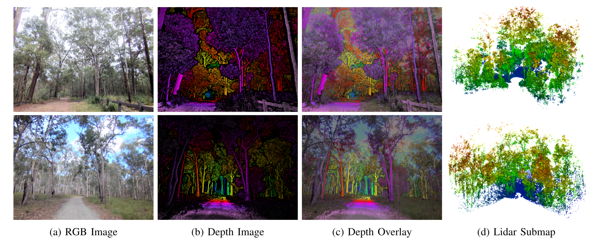
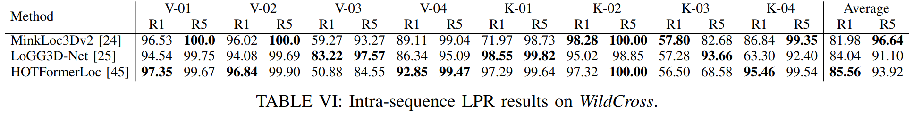
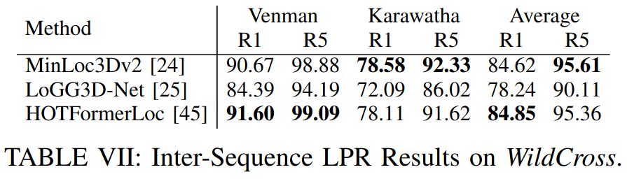

# WildCross: A Cross-Modal Large Scale Benchmark for Place Recognition and Metric Depth Estimation in Natural Environments
<!-- ## [Website](https://csiro-robotics.github.io/Wild-Places/) | [Paper](https://arxiv.org/abs/2211.12732) | [Data Download Portal](https://data.csiro.au/collection/csiro:56372?q=wild-places&_st=keyword&_str=1&_si=1) -->

<div align="center">
<a href=""></a>
<a href='https://csiro-robotics.github.io/WildCross'></a>
<a href='https://huggingface.co/CSIRORobotics/WildCross'></a>
<a href=''></a>
</div>


This branch contains the code implementation used for LPR training and evaluation in the paper *WildCross: A Cross-Modal Large Scale Benchmark for Place Recognition and Metric Depth Estimation in Natural Environments*, which has been accepted for publication at ICRA2025.  

**Note: If you are reading this, you are on the WildCross branch and will be using the WildCross crossfold evaluation splits.  Make sure that this is what you want!**

If you find this dataset helpful for your research, please cite our paper using the following reference:
```
@misc{knights2025wildcross,
  title={{WildCross: A Cross-Modal Large Scale Benchmark for Place Recognition and Metric Depth Estimation in Natural Environments}},
  author={Joshua Knights, Joseph Reid, Mark Cox, Kaushik Roy, David Hall, Peyman Moghadam},
  year={2025},
  eprint={xxxxxxxxx},
  archivePrefix={arXiv},
  primaryClass={cs.CV},
  url={https://arxiv.org/abs/xxxxxxxxxx},
}
```

## Contents
1. [Updates](#updates)
2. [Download Instructions](#download-instructions)
3. [Benchmarking](#benchmarking)
    * [Checkpoints](#checkpoints)
    * [Performance](#performance)
4. [Scripts](#scripts)
    * [Loading Point Clouds](#loading-point-clouds)
    * [Training](#training)
    * [Evaluation](#evaluation)
4. [Thanks](#thanks)

## Updates 
- **Feb 2026** WildCross v1.0 LPR code uploaded

## Download Instructions

The WildCross dataset can be downloaded through [The CSIRO Data Access Portal](). Detailed instructions for downloading the dataset can be found in the README file provided on the data access portal page. 


## Benchmarking
Here we provided pre-trained checkpoints and results for benchmarking several state-of-the-art LPR methods on the WildCross dataset.

| Model | Split | Link |
|:-|:-|:-:|
|LoGG3D-Net|Split 1|[Download](https://huggingface.co/CSIRORobotics/WildCross/resolve/main/LPR/LoGG3DNet/split_1.pth)|
||Split 2|[Download](https://huggingface.co/CSIRORobotics/WildCross/resolve/main/LPR/LoGG3DNet/split_2.pth)|
||Split 3|[Download](https://huggingface.co/CSIRORobotics/WildCross/resolve/main/LPR/LoGG3DNet/split_3.pth)|
||Split 4|[Download](https://huggingface.co/CSIRORobotics/WildCross/resolve/main/LPR/LoGG3DNet/split_4.pth)|
|MinkLoc3Dv2|Split 1|[Download](https://huggingface.co/CSIRORobotics/WildCross/resolve/main/LPR/MinkLoc3Dv2/split_1.pth)|
||Split 2|[Download](https://huggingface.co/CSIRORobotics/WildCross/resolve/main/LPR/MinkLoc3Dv2/split_2.pth)|
||Split 3|[Download](https://huggingface.co/CSIRORobotics/WildCross/resolve/main/LPR/MinkLoc3Dv2/split_3.pth)|
||Split 4|[Download](https://huggingface.co/CSIRORobotics/WildCross/resolve/main/LPR/MinkLoc3Dv2/split_4.pth)|
|HOTFormerLoc|Split 1|[Download](https://huggingface.co/CSIRORobotics/WildCross/resolve/main/LPR/HotFormerLoc/split_1.pth)|
||Split 2|[Download](https://huggingface.co/CSIRORobotics/WildCross/resolve/main/LPR/HotFormerLoc/split_2.pth)|
||Split 3|[Download](https://huggingface.co/CSIRORobotics/WildCross/resolve/main/LPR/HotFormerLoc/split_3.pth)|
||Split 4|[Download](https://huggingface.co/CSIRORobotics/WildCross/resolve/main/LPR/HotFormerLoc/split_4.pth)|

**Note**: As in the paper, here we use 1-indexing such that `split_idx 1` means that V-01 and K-01 are held out for evaluation and the rest of the data is used for training.

### Performance




## Scripts
### Loading Point Clouds
A code snippet to load a pointcloud file from our dataset can be found in `eval/load_pointcloud.py`
### Training
We provide instructions for how to train three state-of-the-art Lidar Place Recognition systems on the WildCross dataset.
These are [LoGG3D-Net](https://github.com/csiro-robotics/LoGG3D-Net), [MinkLoc3Dv2](https://github.com/jac99/MinkLoc3Dv2), and [HOTFormerLoc](https://github.com/csiro-robotics/HOTFormerLoc).  For more detailed instructions, please consult the `README.md` files in `training/LoGG3D-Net`, `training/MinkLoc3Dv2`, and `training/HOTFormerLoc`.
### Evaluation
We provide standardised evaluation code for evaluating performance on the WildCross dataset crossfold validation splits.
This is evaluation for both the inter and intra-sequence testing scenarios.
For more details, please see the `README.md` file in the `eval` folder.
Within we have a framework for evaluating future LPR methods as well as evaluation code to replicate the results attained in the original WildCross paper for LoGG3D-Net, MinkLoc3Dv2, and HOTFormerLoc.

## Thanks
Special thanks to the authors of the [PointNetVLAD](https://github.com/mikacuy/pointnetvlad) and [MinkLoc3D](https://github.com/jac99/MinkLoc3D), whose excellent code was used as a basis for the generation and evaluation scripts used in this repository. 

