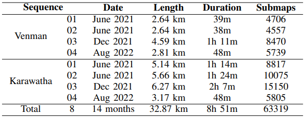
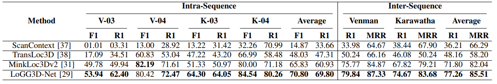

<html>
   <head></head>
   <body>
      <link rel="stylesheet" type="text/css" href="./github.css" id="_theme">
      

         <meta charset="UTF-8">
         <meta name="description" content="Wild-Places: A Large-Scale Dataset for Lidar Place Recognition in Unstructured Natural Environments">
         <meta name="keywords" content="wild-places dataset, offroad, natural, 3d, place recognition">
         <link rel="shortcut icon" href="./favicon.ico">
         

            <h1 id="Wild-Places: A Large-Scale Dataset for Lidar Place Recognition in Unstructured Natural Environments">Wild-Places: A Large-Scale Dataset for Lidar Place Recognition in Unstructured Natural Environments 1</h1>
            
<strong>
            <a href="https://scholar.google.com/citations?user=RxbGr2EAAAAJ&hl=en">Joshua Knights*,1,2</a> &nbsp;&nbsp;&nbsp;
            <a href="https://scholar.google.com/citations?user=BUvScBEAAAAJ&hl=en">Kavisha Vidanapathirana*,1,2</a> &nbsp;&nbsp;&nbsp;
            <a href="https://scholar.google.com/citations?hl=en&user=fn-lMpMAAAAJ">Milad Ramezani1</a> &nbsp;&nbsp;&nbsp;
            <a href="https://scholar.google.com/citations?user=v8-lMdUAAAAJ&hl=en">Sridha Sridharan2</a> &nbsp;&nbsp;&nbsp;
            <a href="https://scholar.google.com.au/citations?user=VpaJsNQAAAAJ&hl=en">Clinton Fookes2</a> &nbsp;&nbsp;&nbsp;
            <a href="https://scholar.google.com.au/citations?user=QAVcuWUAAAAJ&hl=en">Peyman Moghadam1,2</a> &nbsp;&nbsp;&nbsp; </strong>

            
* Equal Contribution
             1Robotics and Autonomous Systems Group, DATA61, CSIRO, Australia.  E-mails:  firstname.lastname@data61.csiro.au
             2School of Electrical Engineering and Robotics, Queensland University of Technology (QUT), Australia.  E-mails:  {s.sridharan,c.fookes}@qut.edu.au
            

            <h3 id="abstract--paper--SCD--Proposed-baseline-method-on-SCD--leaderboard--attn"><a href="#1-abstract">Abstract</a> | <a href="#2-paper">Paper</a> | <a href="#3-Images">Images</a> | <a href="#4-Dataset">Dataset Information</a> | <a href="#5-Benchmarking">Benchmarking</a> | <a href="#6-Download">Download</a></h3>
         <!-- 
            ###################
            SECTION 1 - ABSTRACT
            ###################
          -->
         <h2 id="1-abstract"><a class="anchor" name="1-abstract" href="#1-abstract"></a>1. Abstract</h2>
         
<em>&nbsp;&nbsp;&nbsp;&nbsp;&nbsp; Many existing datasets for lidar place recognition are solely representative of structured urban environments, and have recently been saturated in performance by deep learning based approaches. Natural and unstructured environments present many additional challenges for the tasks of long-term localisation but these environments are not represented in currently available datasets.  To address this we introduce Wild-Places, a challenging large-scale dataset for lidar place recognition in unstructured, natural environments.  Wild-Places contains eight lidar sequences collected with a handheld sensor payload over the course of fourteen months, containing a total of 67K undistorted lidar submaps along with accurate 6DoF ground truth.  Our dataset contains multiple revisits both within and between sequences, allowing for both intra-sequence (i.e. loop closure detection) and inter-sequence (i.e. re-localisation) place recognition.  We also benchmark several state-of-the-art approaches to demonstrate the challenges that this dataset introduces, particularly the case of long-term place recognition due to natural environments changing over time. </em>

         <!-- 
            ###################
            SECTION 2 - PAPER
            ###################
          -->
         <h2 id="2-paper"><a class="anchor" name="2-paper" href="#2-paper"></a>2. Paper</h2>
         

               
            
<a href="https://arxiv.org/"><strong>Paper on arXiv =&gt; "Wild-Places: A Large-Scale Dataset for Lidar Place Recognition in Unstructured Natural Environments"</strong></a>

         

         <!-- 
            ###################
            SECTION 3 - IMAGES
            ###################
          -->
         <h2 id="3-Images"><a class="anchor" name="3-Wild-Places" href="#3-Images"></a>3. Images</h2>
         <h4 id="31-environments"><a class="anchor" name="31-environments" href="#31-environments">
         </a>3.1 Sequences & Environments</h4>
         

            
         

         
Environment and sequence visualisation.  The top row shows the trajectory of two sequences - V-03 and K-02 - overlaid on a satellite image of their respective environments.  The bottom row shows the trajectory of sequences 01, 02, 03 & 04 on each environment from top to bottom, respectively.

         <h4 id="32-Global-Map"><a class="anchor" name="32-Global-Map" href="#32-Global-Map">
         </a>3.2 Global Map</h4>
         

            
         

         
 Visualisation of the Global Map.  We use Wildcat SLAM to create an undistorted global point cloud map for each sequence, from which we extract the submaps used during training and evaluation.

         <h4 id="33-Diversity"><a class="anchor" name="33-Diversity" href="#33-Diversity">
         </a>3.3 Diversity</h4>
         

            
         

         
Visualisation of the diversity in environments present in the Wild-Places dataset.  The top row shows RGB images from the front camera of the sensor payload, while the bottom row shows the point cloud visualisation corresponding to the camera pose in the global point cloud.

        <!-- 
            ###################
            SECTION 4 - Dataset Information
            ###################
          -->
        <h2 id="4-Dataset"><a class="anchor" name="3-Wild-Places" href="#4-DATASET">
        </a>4. Dataset Information</h2>
        <h4 id="41-Comparison"><a class="anchor" name="41-Comparison" href="#41-Comparison">
         </a>4.1 Comparison</h4>
         

            
         

         
Comparison of public lidar datasets. The top half of the table shows the most popular lidar datasets used for large-scale localisation evaluation. The bottom half shows public lidar datasets which contain only natural and unstructured environments. Wild-Places is the only dataset that satisfies both of these criteria.  We define long-term revisits here as a time gap greater than 1 year. * Post-processed variation introduced in PointNetVLAD

         <h4 id="42-Sequences"><a class="anchor" name="42-Sequences" href="#42-Sequences">
         </a>4.2 Sequences</h4>
         

            
         

         Per-Sequence Information for the Wild-Places Dataset.  We collect a total of eight lidar sequences in two environments over the span of fourteen months for a total of 35.33km traversed distance and approximately 67K point cloud submaps.
         <!-- 
            ###################
            SECTION 5 - Benchmarking
            ###################
          -->
        <h2 id="5-Benchmarking"><a class="anchor" name="5-Benchmarking" href="#5-Benchmarking"></a>5. Benchmarking</h2>
        <!-- <h4 id="51-Table"><a class="anchor" name="51-Table" href="#51-Table">
        </a>5.1 Benchmarking Results</h4> -->
        

            
         

         

            
         

         We benchmark four state-of-the-art approaches on our dataset: ScanContext as a strong handcrafted baseline, and TransLoc3D, MinkLoc3Dv2 and LoGG3D-Net as learning-based approaches.  For both intra and inter-run place recognition our dataset challenges the existing state-of-art.  In addition, in the inter-run place recognition task we demonstrate the challenge posed by long-term place recognition in natural environments due to gradual changes over time.
        <!-- 
            ###################
            SECTION 6 - Download
            ###################
          -->
        <h2 id="6-Download"><a class="anchor" name="6-Download" href="#6-Download"></a>6. Download</h2>
        <h4 id="61-Checkpoints"><a class="anchor" name="61-Checkpoints" href="#61-Checkpoints">
        </a>6.1 Checkpoint Download</h4>
        

            <table class="tg" border="0">
               <thead>
                  <tr>
                     <th class="tg-0lax">Model</th>
                     <th class="tg-0lax">Checkpoint</th>
                  </tr>
                  </thead>
               <tbody>
                  <tr>
                     <td class="tg-0lax">TransLoc3D </td>
                     <td class="tg-0lax"><a href="https://cloudstor.aarnet.edu.au/plus/s/ODFBQ0t7ME1QoJJ" target="_blank" rel="noopener noreferrer">Link</a></td>
                  </tr>
                  <tr>
                     <td class="tg-0lax">MinkLoc3Dv2</td>
                     <td class="tg-0lax"><a href="https://cloudstor.aarnet.edu.au/plus/s/Gi68q66sHlKgt7A" target="_blank" rel="noopener noreferrer">Link</a></td>
                  </tr>
                  <tr>
                     <td class="tg-0lax">LoGG3D-Net</td>
                     <td class="tg-0lax"><a href="" target="_blank" rel="noopener noreferrer">Link</a></td>
                  </tr>
               </tbody>
            </table>
         

         The links in the above table will allow you to download checkpoints for our trained models on the TransLoc3D, MinkLoc3Dv2 and LoGG3D-Net architectures trained in the paper associated with this dataset release.
         <h4 id="62-Dataset"><a class="anchor" name="62-Dataset" href="#62-dataset">
         </a>6.2 Dataset Download</h4>
         Our dataset can be downloaded through <a href="https://data.csiro.au/"> The CSIRO Data Access Portal</a>.  Detailed instructions for downloading the dataset can be found in the README file provided on the data access portal page.
         <h4 id="63-License"><a class="anchor" name="63-Dataset" href="#63-dataset">
         </a>6.3 License</h4>
         
          We release this dataset under a <a href="https://creativecommons.org/licenses/by-nc-sa/4.0/"> Creative Commons Attribution Noncommercial-Share Alike 4.0 Licence </a>
        <!-- 
            ###################
            END OF OUR CONTENT
            ###################
          -->
   
